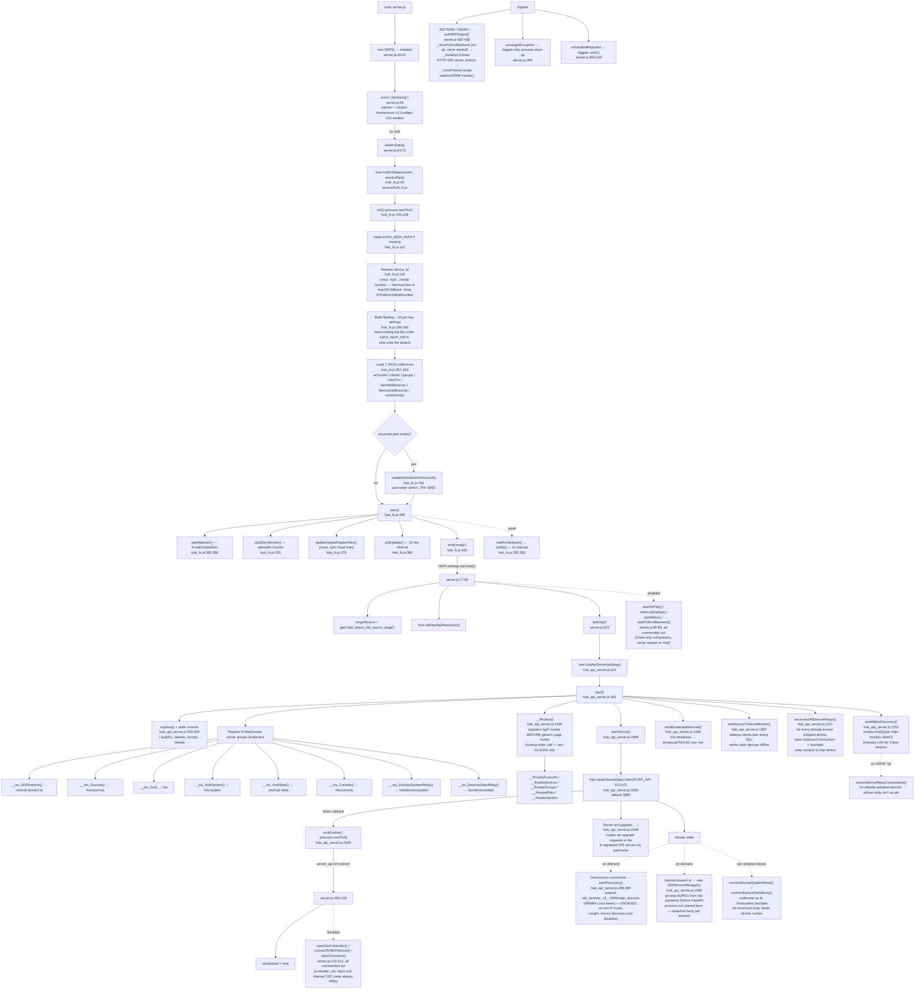

# Hub — Startup Process Tree

Traces exactly what happens from process launch (`node server.js`) through
the Hub reaching steady state. Built by reading the actual source (not
inferred) — see file:line references throughout. Reflects the code as it
exists today, including subsystems that are present but intentionally
disabled (commented out) since this repo was cloned from the Client repo.

## Visualization

## Notes on what's *not* pictured

- **Disabled-but-present Client subsystems**: `startAirPlay()`,
  `startLcdDisplay()`, `startMdns()` (mDNS *broadcast* — distinct from the
  Hub's own mDNS *discovery* in `startMdnsDiscovery()`), `startPythonBackend()`,
  `openCecController()`, `connectToNDPiServer()`, `startChromium()` all
  still exist as methods on the `NDPi` class in `server.js` but their call
  sites are commented out. `this.controller_cec` is therefore always
  `null` — any route that touches it (the internal CEC proxy) always
  400s. These were deliberately left in place by a prior session rather
  than deleted, matching the Client's own `index.js` shape for easier
  diffing.
- **`ndi-backend/` Python FastAPI process**: not started by `server.js`
  at all — `NDIStreamManager` (`service/NDIStreamManager.js`) is
  instantiated lazily, once per `/ws/ndi-stream/:id` browser connection,
  and presumably talks to a Python backend that must already be running
  separately (out of scope for this file — nothing in the traced startup
  path spawns it).
- **`./ndi-discover`, `ndpi_discover`**: ARM64 Linux binaries. On this
  repo's macOS dev environment `spawn()` fails with `ENOEXEC`; the
  failure is caught (`hub_api_server.js:397-405`) so the Hub keeps
  running with source discovery simply disabled. On real Pi hardware this
  spawns and streams live NDI source listings.
